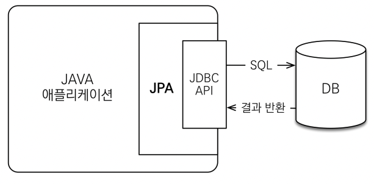

# JPA 소개


## 목차

1. SQL 중심적인 개발의 문제점
2. JPA 소개
3. Hello JPA - 프로젝트 생성
4. Hello JPA - 애플리케이션 개발

------


## 1. SQL 중심적인 개발의 문제점

- 애플리케이션 - 객체 지향 언어 (Java, Scala, ..)
- 데이터베이스 - RDB (Oracle, MySQL, ...)
- → 지금 시대는 객체를 RDB에 저장하는 시대

### 문제점

- 무한 반복, 지루한 코드

  - CRUD
    - insert into ...
    - selct ...
    - update ...
    - delete ...
  - 객체를 SQL로 ...
  - SQL을 객체로 ...

- 객체 필드 추가시 모든 SQL을 변경

  - SQL 의존적 개발을 피하기 어렵다.

- 패러라임의 불일치

  - 객체 vs 관계형

    - 상속

      - 객체: 다형성을 이용해서 컬렉션에 저장
      - 관계형: 수퍼타입 테이블과 서브타입 테이블에 각각 insert into

    - 연관관계

      - 객체: 참조를 사용
      - 관계형: FK를 이용해서 JOIN

    - 데이터 타입

    - 데이터 식별 방법

      - 객체: 컬렉션에서 두 객체를 같은 아이디로 조회하고 ‘==’으로 조회하면 true

        ```java
        String memberId = 1;
        Member member1 = list.get(memberId);
        Member member2 = list.get(memberId);
        
        member1 == member2 // 같다.
        ```

      - 관계: SQL로 같은 아이디로 두번 조회하고 ‘==’ 하면 false

        ```java
        String sql = "SELECT * FROM MEMBER WHERE MEMBER_ID = ?"
        ...
        // JDBC API, SQL 실행
        return new MEMBER(...);
        ```

### 즉, 객체 지향적으로 설계할 수록 매핑 작업만 늘어난다.


## 2. JPA 소개

- Java Persistence API
- 자바 진영의 ORM 기술 표준

### ORM 이란?

- Object-Relational Mapping (객체 관계 매핑)
- 객체는 객체대로 설계
- 관계형 데이터베이스는 관계형 데이터베이스대로 설계
- ORM 프레임워크가 중간에서 매핑
- 대중적인 언어에는 대부분 ORM 기술이 존재

### JPA의 동작

- JPA는 애플리케이션과 JDBC 사이에서 동작

  

  - 애플리케이션 → JPA API 사용
  - JPA → JDBC API 사용

- 저장

  

- 조회

  

### JPA는 표준 명세

- JPA는 인터페이스의 모음

- JPA 표준 명세를 구현한 3가지 구현체

- 하이버네이트, EclipseLink, DataNucleus

  

### JPA 사용의 장점

- SQL 중심적인 개발에서 객체 중심으로 개발

- 생산성

  - 저장: jpa.persist(member)
  - 조회: jpa.find(memberId)
  - 수정: member.setName(”변경")
  - 삭제: jpa.remove(member)

- 유지보수

  - 기존: 필드 추가시 모든 SQL 수정
  - JPA: 필드만 추가하면됨, SQL은 JPA가 처리

- 패러다임의 불일치

  - 상속

    - 기존: 수퍼타입 테이블과 서브타입 테이블에 각각 insert into
    - JPA: 다형성을 이용해서 컬렉션에 저장 후, jpa.persist(member)

  - 연관관계, 객체 그래프 탐색

    ```java
    // 연관관계 저장
    member.setTeam(team);
    jpa.persist(member);
    
    // 객체 그래프 탐색
    Member member = jpa.find(Member.class, memberId);
    Team team = member.getTeam(); // 자유로운 객체 그래프 탐색
    ```

  - JPA의 비교

    ```java
    String memberId = 1;
    Member member1 = jpa.find(Member.class, memberId);
    Member member2 = jpa.find(Member.class, memberId);
    
    member1 == member2 // 같다.
    ```

    - 동일한 트랙잭션에서 조회한 엔티티는 같음을 보장받는다.

- 성능

  1. 1차 캐시와 동일성(identity) 보장

     - 같은 트랙잭션 안에서는 같은 엔티티를 반환 - 약간의 조회 성능 향상
       - 같은 엔티티 조회시 SQL은 1번만 실행
     - DB Isolation Level이 Read Commit 이어도 애플리케이션에서 Repeatable Read 보장

  2. 트랜잭션을 지원하는 쓰기 지연 (transactional write-behind)

     - 트랜잭션을 커밋할 때까지 insert SQL을 모음
     - JDBC BATCH SQL 기능을 사용해서 한번에 SQL 전송

     ```java
     transaction.begin(); // 트랜잭션 시작
     
     em.persist(memberA);
     em.persist(memberB);
     em.persist(memberC); // 여기까지 insert SQL을 데이터베이스에 보내지 않는다.
     
     transaction.commit(); // 트랜색션 커밋, insert SQL을 보낸다.
     ```

  3. 지연 로딩 (Lazy Loading)

     - 지연 로딩: 객체가 실제 사용될 때 로딩
     - 즉시 로딩: JOIN SQL로 한번에 연관된 객체까지 미리 조회

- 데이터 접근 추상화와 벤더 독립성

- 표준


## 3. Hello JPA - 프로젝트 생성

### H2 데이터베이스 설치 및 실행

- 가볍다. (1.5M)
- 웹용 쿼리툴 제공
- MySQL, Oracle 데이터베이스 시뮬레이션 기능
- 시퀀스, auto increament 기능 지원

1. http://www.h2database.com/
2. h2/bin/h2.sh 실행
3. 연결
   - 저장한 설정: Generic H2 (Server)
   - 설정 이름: Generic H2 (Server)
   - 드라이버 클래스: org.h2.Driver
   - JDBC URL: jdbc:h2:~/test
   - 사용자명: sa
   - 비밀번호: 없음

### 메이븐 소개

- https://maven.apache.org/
- 자바 라이브러리, 빌드 관리
- 라이브러리 자동 다운로드 및 의존성 관리
- 최근에는 그래들(gradle)이 점점 유명

### 프로젝트 생성

- 자바 8 이상

- 메이븐 설정

  - groupId: jpa-basic
  - articleId: ex1-hello-jpa
  - version: 1.0.0

  ```java
  <?xml version="1.0" encoding="UTF-8"?>
  <project xmlns="<http://maven.apache.org/POM/4.0.0>"
   xmlns:xsi="<http://www.w3.org/2001/XMLSchema-instance>"
   xsi:schemaLocation="<http://maven.apache.org/POM/4.0.0> <http://maven.apache.org/xsd/maven-4.0.0.xsd>">
  		 <modelVersion>4.0.0</modelVersion>
  				 <groupId>jpa-basic</groupId>
  				 <artifactId>ex1-hello-jpa</artifactId>
  				 <version>1.0.0</version>
  				 <dependencies>
  						 <!-- JPA 하이버네이트 -->
  						 <dependency>
  								 <groupId>org.hibernate</groupId>
  								 <artifactId>hibernate-entitymanager</artifactId>
  								 <version>5.3.10.Final</version>
  						 </dependency>
  
  						 <!-- H2 데이터베이스 -->
  				 <dependency>
  						 <groupId>com.h2database</groupId>
  						 <artifactId>h2</artifactId>
  						 <version>다운로드한 h2 버전</version>
  				 </dependency>
  		 </dependencies>
  </project>
  ```

### JPA 설정하기 - persistence.xml

- JPA 설정 파일
- /META-INF/persistence.xml 위치
- persistence-unit name으로 이름 지정
- javax.persistence로 시작: JPA 표준 속성
- hibernate로 시작: 하이버네이트 전용 속성

```java
<?xml version="1.0" encoding="UTF-8"?>
<persistence version="2.2"
 xmlns="<http://xmlns.jcp.org/xml/ns/persistence>" xmlns:xsi="<http://www.w3.org/2001/XMLSchema-instance>"
 xsi:schemaLocation="<http://xmlns.jcp.org/xml/ns/persistence> <http://xmlns.jcp.org/xml/ns/persistence/persistence_2_2.xsd>">
		 <persistence-unit name="hello">
				 <properties>
						 <!-- 필수 속성 -->
						 <property name="javax.persistence.jdbc.driver" value="org.h2.Driver"/>
						 <property name="javax.persistence.jdbc.user" value="sa"/>
						 <property name="javax.persistence.jdbc.password" value=""/>
						 <property name="javax.persistence.jdbc.url" value="jdbc:h2:tcp://localhost/~/test"/>
						 <property name="hibernate.dialect" value="org.hibernate.dialect.H2Dialect"/>
						
						 <!-- 옵션 -->
						 <property name="hibernate.show_sql" value="true"/>
						 <property name="hibernate.format_sql" value="true"/>
						 <property name="hibernate.use_sql_comments" value="true"/>
						 <!--<property name="hibernate.hbm2ddl.auto" value="create" />-->
				 </properties>
		 </persistence-unit>
</persistence>
```

### 데이터베이스 방언

- JPA는 특정 데이터베이스에 종속되지 않음
- 각각의 데이터베이스가 제공하는 SQL 문법과 함수는 조금씩 다름
  - 가변 문자: MySQL은 VARCHAR, Oracle은 VARCHAR2
  - 문자열을 자르는 함수: SQL 표준은 SUBSTRING(), Oracle은 SUBSTR()
  - 페이징: MySQL은 LIMIT, Oracle은 ROWNUM
- 방언: SQL 표준을 지키지 않는 특정 데이터베이스만의 고유한 기능
- hibernate.dialect 속성에 지정
  - H2: org.hibernate.dialect.H2Dialect
  - Oracle 10g: org.hibernate.dialect.Oracle10gDialect
  - MySQL: org.hibernate.dialect.MySQL5InnoDBDialect
- 하이버네이트는 40가지 이상의 데이터베이스 방언 지원


```java
// persistence.xml
<property name="hibernate.dialect" value="org.hibernate.dialect.H2Dialect"/>
```


## 4. Hello JPA - 애플리케이션 개발

### JPA 구동 방식


1. Persistence 클래스가 persistence.xml 설정 정보를 조회한다.
2. Persistence 클래스가 EntityManagerFactory 클래스를 생성한다.
3. EntityManagerFactory 클래스가 EntityManager를 생성한다.

### 실습 - JPA 동작 확인

- JpaMain 클래스 생성
- Jpa 동작 확인

```java
package hellojpa;

import javax.persistence.EntityManager;
import javax.persistence.EntityManagerFactory;
import javax.persistence.Persistence;

public class JpaMain {
    public static void main(String[] args) {
        EntityManagerFactory emf = Persistence.createEntityManagerFactory("hello");

        EntityManager em = emf.createEntityManager();

        // code
        
        em.close();

        emf.close();
    }
}
```

### 객체와 테이블을 생성하고 매핑하기

- @Entity: JPA가 관리할 객체

- @Id: 데이터베이스 PK와 매핑

- H2 데이터베이스 쿼리

  ```java
  create table Member (
  	 id bigint not null,
  	 name varchar(255),
  	 primary key (id)
  );
  ```

- Member.java

  ```java
  package hellojpa;
  
  import javax.persistence.Entity;
  import javax.persistence.Id;
  
  @Entity
  public class Member {
  
      @Id
      private Long id;
      private String name;
  
      public Long getId() {
          return id;
      }
  
      public void setId(Long id) {
          this.id = id;
      }
  
      public String getName() {
          return name;
      }
  
      public void setName(String name) {
          this.name = name;
      }
  }
  ```

### 실습 - 회원 저장

- 회원 등록

  ```java
  package hellojpa;
  
  import javax.persistence.EntityManager;
  import javax.persistence.EntityManagerFactory;
  import javax.persistence.EntityTransaction;
  import javax.persistence.Persistence;
  
  public class JpaMain {
      public static void main(String[] args) {
          EntityManagerFactory emf = Persistence.createEntityManagerFactory("hello");
          EntityManager em = emf.createEntityManager();
  
          EntityTransaction tx = em.getTransaction();
          tx.begin();
  
          try {
              Member member = new Member();
  						member.setId(1L);
  						member.setName("memberA");
  
  						em.persist(member);
  
  						tx.commit();
          } catch (Exception e) {
              tx.rollback();
          } finally {
              em.close();
          }
  
          emf.close();
      }
  }
  ```

- 회원 수정

  ```java
  package hellojpa;
  
  import javax.persistence.EntityManager;
  import javax.persistence.EntityManagerFactory;
  import javax.persistence.EntityTransaction;
  import javax.persistence.Persistence;
  
  public class JpaMain {
      public static void main(String[] args) {
          EntityManagerFactory emf = Persistence.createEntityManagerFactory("hello");
          EntityManager em = emf.createEntityManager();
  
          EntityTransaction tx = em.getTransaction();
          tx.begin();
  
          try {
              Member findMember = em.find(Member.class, 1L);
              findMember.setName("HelloJPA");
  
              tx.commit();
          } catch (Exception e) {
              tx.rollback();
          } finally {
              em.close();
          }
  
          emf.close();
      }
  }
  ```

- 회원 삭제

  ```java
  package hellojpa;
  
  import javax.persistence.EntityManager;
  import javax.persistence.EntityManagerFactory;
  import javax.persistence.EntityTransaction;
  import javax.persistence.Persistence;
  
  public class JpaMain {
      public static void main(String[] args) {
          EntityManagerFactory emf = Persistence.createEntityManagerFactory("hello");
          EntityManager em = emf.createEntityManager();
  
          EntityTransaction tx = em.getTransaction();
          tx.begin();
  
          try {
              Member findMember = em.find(Member.class, 1L);
              em.remove(findMember);
  
              tx.commit();
          } catch (Exception e) {
              tx.rollback();
          } finally {
              em.close();
          }
  
          emf.close();
      }
  }
  ```

- 회원 단 건 조회

  ```java
  package hellojpa;
  
  import javax.persistence.EntityManager;
  import javax.persistence.EntityManagerFactory;
  import javax.persistence.EntityTransaction;
  import javax.persistence.Persistence;
  
  public class JpaMain {
      public static void main(String[] args) {
          EntityManagerFactory emf = Persistence.createEntityManagerFactory("hello");
          EntityManager em = emf.createEntityManager();
  
          EntityTransaction tx = em.getTransaction();
          tx.begin();
  
          try {
              Member findMember = em.find(Member.class, 1L);
              System.out.println("findMember.id = " + findMember.getId());
              System.out.println("findMember.name = " + findMember.getName());
  
              tx.commit();
          } catch (Exception e) {
              tx.rollback();
          } finally {
              em.close();
          }
  
          emf.close();
      }
  }
  ```

### 주의

- **EntityManagerFactory**는 하나만 생성해서 애플리케이션 전체에서 공유

- EntityManager

  는 쓰레드 간에 공유하면 안됨 (사용하고 버려야 한다.)

  - 요청마다 작업은 EntityManager 에서 진행해야 한다.

- **JPA의 모든 데이터 변경은 트랜잭션 안에서 실행**

### JPQL 소개

- 가장 단순한 조회 방법
  - EntityManager.find()
  - 객체 그래프 탐색 (a.getB().getC())
- 나이가 18살 이상인 회원을 모두 검색하고 싶다면?

### JPQL

- JPA를 사용하면 엔티티를 객체 중심으로 개발
- 문제는 검색 쿼리
- 검색을 할 때도 테이블이 아닌 엔티티 객체를 대상으로 검색
- 모든 DB 데이터를 객체로 변환해서 검색하는 것을 불가능
- 애플리케이션이 필요한 데이터만 DB에서 불러오려면 결국 검색 조건이 포함된 SQL이 필요.
- JPA는 SQL을 추상화한 JPQL이라는 객체 지향 쿼리 언어 제공
- SQL과 문법 유사, SELECT, FROM, WHERE, GROUP BY, HAVING, JOIN 지원
- **JPQL은 엔티티 객체를 대상**으로 쿼리
- **SQL은 데이터베이스 테이블을 대상**으로 쿼리

### 실습 - JPQL 소개

- JPQL로 전체 회원 검색

  ```java
  package hellojpa;
  
  import javax.persistence.*;
  import java.util.List;
  
  public class JpaMain {
      public static void main(String[] args) {
          EntityManagerFactory emf = Persistence.createEntityManagerFactory("hello");
          EntityManager em = emf.createEntityManager();
  
          EntityTransaction tx = em.getTransaction();
          tx.begin();
  
          try {
              List<Member> result = em.createQuery("select m from Member as m", Member.class)
                      .getResultList();
  
              for (Member member : result) {
                  System.out.println("member.name = " + member.getName());
              }
  
              tx.commit();
          } catch (Exception e) {
              tx.rollback();
          } finally {
              em.close();
          }
  
          emf.close();
      }
  }
  ```

- JPQL에 대해 자세한 내용은 객체 지향 쿼리에서 학습