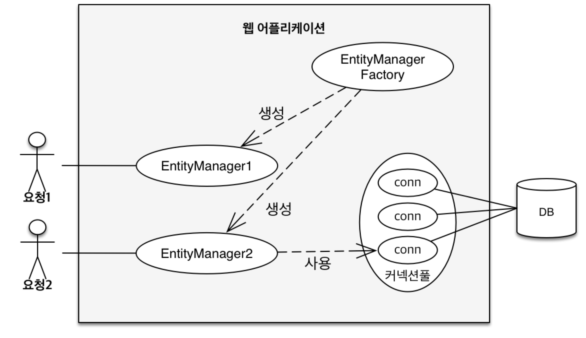

# 영속성 관리 - 내부 동작 방식

## 목차

1. 영속성 컨텍스트
2. 영속성 컨텍스트 이점
3. 플러시
4. 준영속 상태

------


## 1. 영속성 컨텍스트

### JPA에서 가장 중요한 2가지

- 객체와 관계형 데이터베이스 매핑하기
- **영속성 컨텍스트**



### 영속성 컨텍스트

- JPA를 이해하는데 가장 중요한 용어
- 엔티티를 영구 저장하는 환경이라는 뜻
- EntityManager.persist(entity);
  - entity를 DB에 저장하는 것이아니라 영속성 컨텍스트에 저장하는 메서드

### 엔티티 매니저? 영속성 컨텍스트?

- 영속성 컨텍스트는 논리적인 개념
- 눈에 보이지 않는다.
- 엔티티 매니저를 통해서 영속성 컨텍스트에 접근

### 엔티티의 생명주기


- **비영속 (new / transient)**

  - 영속성 컨텍스트와 전혀 관계가 없는 **새로운** 상태

    ```java
    // 객체를 생성한 상태 (비영속)
    Member member = new Member();
    member.setId("member1");
    member.setUsername("회원1");
    ```

- **영속 (managed)**

  - 영속성 컨텍스트에 **관리**되는 상태

    ```java
    Member member = new Member();
    member.setId("member1");
    member.setUsername("회원1");
    
    EntityManager em = emf.createEntityManager();
    em.getTransaction().begin()
    
    // 객체를 저장한 상태 (영속)
    em.persist(member);
    ```

  - 쿼리는 commit()을 호출하면 실행된다.

- **준영속 (detached)**

  - 영속성 컨텍스트에 저장되었다가 **분리**된 상태

    ```java
    // 엔티티를 영속성 컨텍스트에서 분리, 준영속 상태
    em.detach(member);
    ```

- **삭제 (removed)**

  - **삭제**된 상태

    ```java
    // 객체를 삭제한 상태 (삭제)
    em.remove(member);
    ```

### 영속성 컨텍스트의 이점

- 엔티티 조회: 1차 캐시
- 동일성(identity) 보장
- 트랜잭션을 지원하는 쓰기 지연 (transactional write-behind)
- 변경 감지 (Dirty Checking)


## 2. 영속성 컨텍스트 이점

### 엔티티 조회: 1차 캐시

- 엔티티를 영속화 시킨 후, 조회하면 1차 캐시에서 조회한다.

```java
Member member = new Member();
member.setId("member1");
member.setUsername("회원1");

//1차 캐시에 저장됨
em.persist(member);

//1차 캐시에서 조회
Member findMember = em.find(Member.class, "member1");
```


- 1차 캐시에서 엔티티를 조회하지 못하면 DB를 조회한다.

  

- 그러나 일반적으로 영속성 컨텍스트는 데이터베이스 트랜잭션 단위로 생성된다.

  - 즉, 고객의 요청이 끝나면 1차 캐시된 정보도 지워진다.

### 동일성 보장

```java
Member findMember1 = em.find(Member.class, 103L);
Member findMember2 = em.find(Member.class, 103L);

System.out.println(findMember1 == findMember2);
```

- 1차 캐시로 반복 가능한 읽기 등급의 트랜잭션 격리 수준을 데이터베이스가 아닌 애플리케이션에서 제공

  > **트랜잭션 격리수준:** 
  > 동시에 여러 트랜잭션이 처리될 때, 트랜잭션끼리 얼마나 격리되어 있는지
  >
  > **반복 가능한 읽기 등급 (repeatable read):**
  > 같은 정보를 여러번 읽었을 때, 각 정보의 결과가 일치하는 것

### 트랜잭션을 지원하는 쓰기 지연

```java
EntityTransaction tx = em.getTransaction();
tx.begin(); // 트랜잭션 시작

// memberA, memberB 생성

// 여기까지 INSERT SQL을 데이터베이스에 보내지 않는다.
em.persist(memberA);
em.persist(memberB);

// 커밋하는 순간 데이터베이스에 INSERT SQL을 보낸다.
tx.commit(); // 트랜잭션 커밋
```

- persist(memberA)를 실행하면 1차 캐시에 객체가 저장되고, INSERT SQL이 생성되어 쓰기 지연 SQL 저장소에 저장된다.

  

- 마찬가지로, persist(memberB)를 실행하면 1차 캐시에 객체가 저장되고, INSERT SQL이 생성되어 쓰기 지연 SQL 저장소에 저장된다.

  

- commit()이 실행되면 flush가 되면서 쓰기 지연 SQL 저장소가 실행된다.

  

### 변경 감지

- 아래 코드를 실행하면 UPDATE SQL이 실행된다.

  ```java
  Member member = em.find(Member.class, 103L);
  member.setName("ZZZZ");
  ```

- 자바 컬랙션을 다루듯이 값을 변경할 수 있다.

- commit()을 실행하면 내부적으로 flush()가 실행된다.

- flush()가 실행되면 1차 캐시에서 객체의 최초상태인 스냅샷과 비교한다.

- 객체가 바뀌었으면 UPDATE SQL이 생성된다.

  


## 3. 플러시

- 영속성 컨텍스트의 변경 내용을 데이터베이스에 반영
- 영속성 컨텍스트(1차 캐시)를 비우지 않음
- 트랜잭션이라는 작업 단위가 중요 → 커밋 직전에만 동기화 하면 됨

### 플러시 발생시 동작

- 변경 감지
- 수정된 엔티티에 대한 SQL을 쓰기 지연 SQL 저장소에 등록
- 쓰기 지연 SQL 저장소의 쿼리를 데이터베이스에 전송 (등록, 수정, 삭제 쿼리)

### 영속성 컨텍스트를 플러시하는 방법

- em.flush()

  - 직접 호출

- 트랜잭션 커밋

  - 플러시 자동 호출

- JPQL 쿼리 실행

  - 플러시 자동 호출

  ```java
  em.persist(memberA);
  em.persist(memberB);
  
  // JPQL은 SQL로 번역되어 실행되기 때문에 위의 영속상태인 객체를 데이터베이스에서 찾을 수 없음
  // 따라서 JPQL은 기본적으로 flush를 실행 후에 번역되어 데이터베이스에 실행됨
  List<Member> members = em.createQuery("select m from Member m", Member.class).getResultList();
  ```

### 플러시 모드 옵션

```java
em.setFlushMode(FlushModeType.COMMIT)
```

- FlushModeType.AUTO
  - 커밋이나 쿼리를 실행할 때 플러시 (기본값)
- FlushModeType.COMMIT
  - 커밋할 때만 플러시


## 4. 준영속 상태

- 영속 → 준영속
- 영속 상태의 엔티티가 영속성 컨텍스트에서 분리 (detached)
- 영속성 컨텍스트가 제공하는 기능을 사용 못함

### 준영속 상태로 만드는 방법

- em.detach(entity)
  - 특정 엔티티만 준영속 상태로 전환
- em.clear()
  - 영속성 컨텍스트를 완전히 초기화
- em.close()
  - 영속성 컨텍스트를 종료